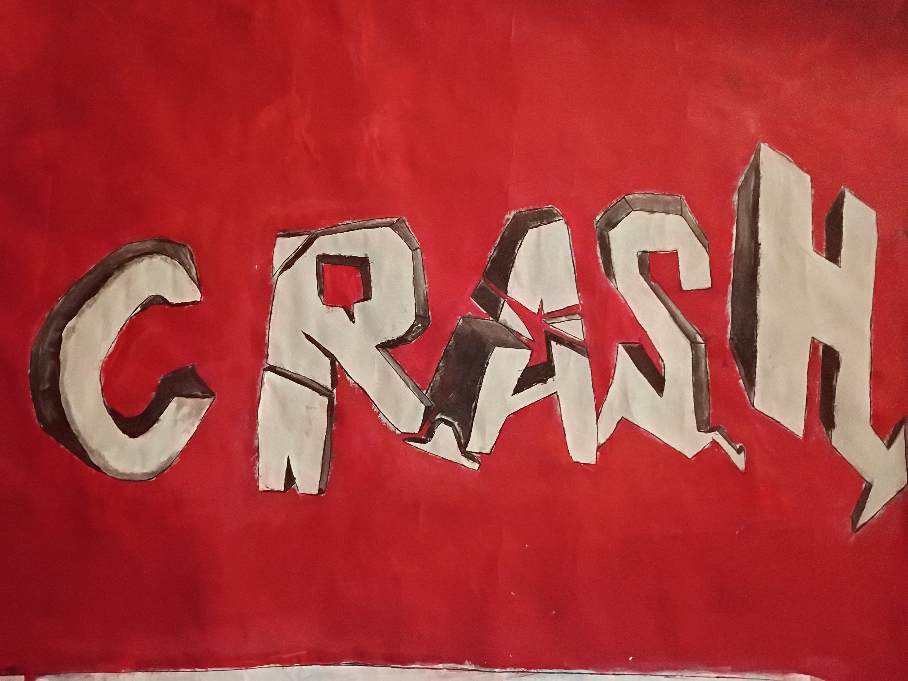
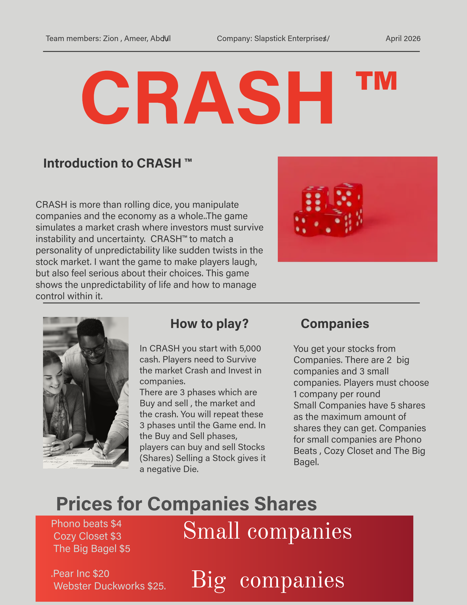
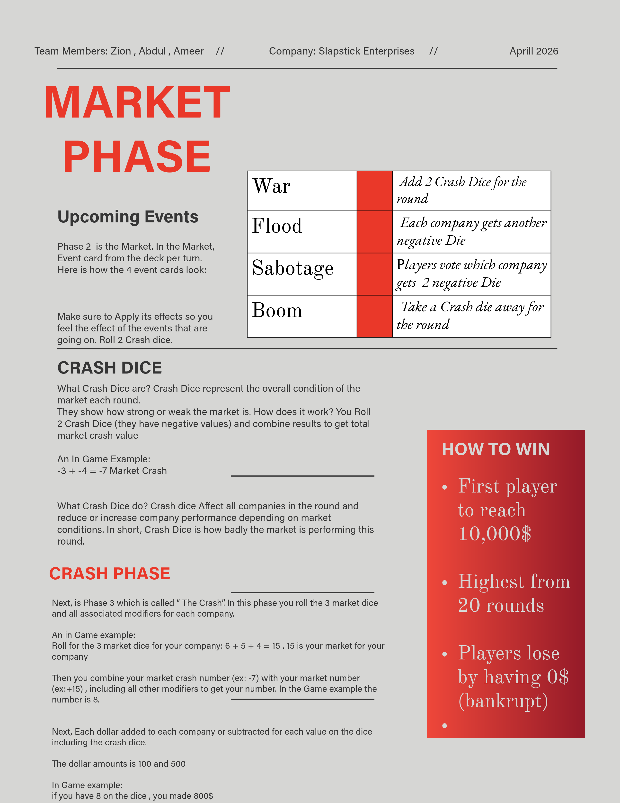

# CRASH™

## Economic Strategy Board Game (Simulation + Chaos Economy Experience)

---

  

## OVERVIEW

CRASH™ is a stock market-inspired economic strategy board game where players experience financial chaos, risk-taking, and decision-making under unpredictable conditions.

Players invest in companies, react to global events, roll crash dice, and survive a volatile economy driven by strategy, luck, and social interaction.

It is both:
- a competitive board game  
- an economic simulation system  
- a social interaction experience  
- a chaos-driven decision engine  

---
## CRASH Rules & Procedures Comparison

  
  

## CORE OBJECTIVE

Players aim to:
- grow wealth from $5,000 starting capital  
- manage investments across companies  
- survive unpredictable market crashes  
- outlast or outperform other players  

---

## GAME DESIGN PHILOSOPHY

CRASH is built on one core idea:

> Economics should be felt, not just calculated.

Instead of teaching through explanation, CRASH teaches through:
- emotion  
- unpredictability  
- social pressure  
- financial consequences  

---

## COMPANY SYSTEM

Players invest in companies with different risk levels.

### Small Companies
- Phono Beats  
- Cozy Closet  
- Big Bagel  

### Large Companies
- Pear Inc  
- Webster Duckworks  

Each company has:
- max shares  
- fluctuating value  
- ownership competition  

---

## CORE GAME LOOP

Each round consists of:

---

### 1. INVESTMENT PHASE

Players:
- buy shares  
- sell shares  
- hold positions  
- compete for ownership  

---

### 2. EVENT PHASE

Event cards introduce global chaos:

- WAR → increases instability  
- FLOOD → economic damage  
- SABOTAGE → disruption effects  
- BOOM → recovery or growth  

Events modify:
- dice outcomes  
- company performance  
- market behavior  

---

### 3. CRASH PHASE

Dice are rolled to simulate market instability.  
Gains and losses are calculated.  
The economy shifts unpredictably.

Example:
- Dice Result: -3 + -4 = -7 market crash  

---

## SOCIAL MECHANICS

Players naturally form behaviors:
- bailouts and alliances  
- aggressive selling strategies  
- company domination attempts  
- panic decision-making  
- emotional reactions  

This creates:

> emergent social gameplay (not scripted behavior)

---

## EMOTIONAL GAME LOOP

CRASH produces rapid emotional shifts:

> excitement → panic → laughter → shock → recovery  

This makes gameplay:
> unpredictable, memorable, and reactive  

---

## CONVENTION EXPERIENCE

CRASH™ was showcased at a live game design convention where it transitioned from prototype to a full interactive experience.

---

### SETUP IMPACT

The table included:
- hand-painted CRASH poster  
- illustrated event cards  
- visible dice system  
- physical tokens and economy components  

Before rules were fully explained:
> people were already gathering around the table  

---

### CROWD FORMATION

Within minutes:
- spectators surrounded the table  
- players joined mid-flow  
- multiple groups stopped to observe  
- people requested to join immediately  

CRASH created a:
> natural attraction loop  

---

### LIVE GAMEPLAY REACTIONS

Crash moments caused:
- sudden losses and shock  
- panic reactions  
- emotional responses  

Event cards caused:
- chaos  
- laughter  
- confusion  
- debate  

Players often:
- refused to sell shares emotionally  
- held tokens tightly  
- bailed each other out  
- competed for control  

Common reaction:
> “I don’t want to go down”

---

### SPECTATOR EFFECT

Even non-players:
- watched reactions closely  
- asked to join  
- reacted to dice outcomes  
- followed gameplay emotionally  

This created a:
> live entertainment feedback loop  

---

## PLAYER FEEDBACK

- “This is genius — no one made a stock game like this before”  
- “It teaches economics in a fun way”  
- “People were rushing to play it”  
- “The illustrations look amazing”  
- “This is actually addictive”  
- “It feels like a real game product”  

---

## DESIGN INSIGHT

CRASH successfully demonstrates:
- economic simulation through interaction  
- chaos-based gameplay systems  
- social decision-making mechanics  
- strong visual identity  
- replayable strategic structure  
- emotional gameplay loops  

---

## DESIGN & DEVELOPMENT

CRASH includes full creative development:
- Adobe Illustrator event cards  
- custom-designed tokens  
- crash dice system  
- large hand-painted poster  
- 3D printed models  
- full system design from scratch  

---

## 👥 TEAM ROLES

### Zion Tucker — Game Designer / Lead Artist

Zion Tucker is responsible for the core creative and gameplay design of CRASH™.

His roles include:
- Game design and overall structure of the experience  
- Designing how mechanics work together as one connected system  
- Creating and developing game assets from the ground up  
- Illustrating event cards and other visual components  
- Designing the visual identity and style of the game  
- Creating and preparing 3D models used in the game  
- Supporting the printing and production of physical 3D assets  
- Designing the large CRASH™ poster (created over 6 hours in a single day)  
- Ensuring that gameplay and visuals work together clearly and cohesively  
- Helping make the game understandable, playable, and engaging  

He is responsible for both:
- the visual development of the game (art, cards, models, assets, poster work)  
- the game design structure that connects everything together  

---

### Ameer — Producer / Financial & Asset Manager

Ameer is responsible for production management and financial planning.

His roles include:
- Managing the financial structure of the project  
- Budgeting all physical and digital assets  
- Evaluating production costs for custom game components  
- Overseeing resource allocation and feasibility  
- Managing overall game budget scaling (e.g., $32,000 → $16,000 planning adjustments)  
- Supporting production decisions for game development  

He ensures:
- the project stays financially realistic  
- all components are properly budgeted  
- production decisions align with available resources  

---

### Abdul — Marketing Lead

Abdul is responsible for marketing and audience outreach.

His roles include:
- Marketing the CRASH™ project  
- Promoting the game to external audiences  
- Increasing visibility and awareness of the project  
- Communicating the game’s value and appeal  
- Supporting outreach strategies for showcasing the game  

He ensures:
- the game reaches the right audience  
- CRASH™ is properly presented publicly  
- interest and engagement are built and maintained  

---

## IMPROVEMENTS IDENTIFIED

Based on playtesting:
- reduce round count (20 → shorter gameplay)  
- improve token labeling clarity  
- streamline calculation tracking  

---

## FUTURE DEVELOPMENT

CRASH is evolving into:
- Python-based digital economy simulator  
- structured stock tracking system  
- automated event engine  
- expanded simulation logic  

---

## FINAL CORE STATEMENT

CRASH™ is not just a board game.

It is:

> a live economic simulation where players experience risk, chaos, and decision-making through emotion, interaction, and unpredictability.

It transforms economics from:

> numbers  
into  
lived experience  

---

## END

CRASH proved at its convention that:
- people rush to join it  
- people emotionally react to it  
- people understand it instantly  
- people want to play it again  
- people treat it like a real product
